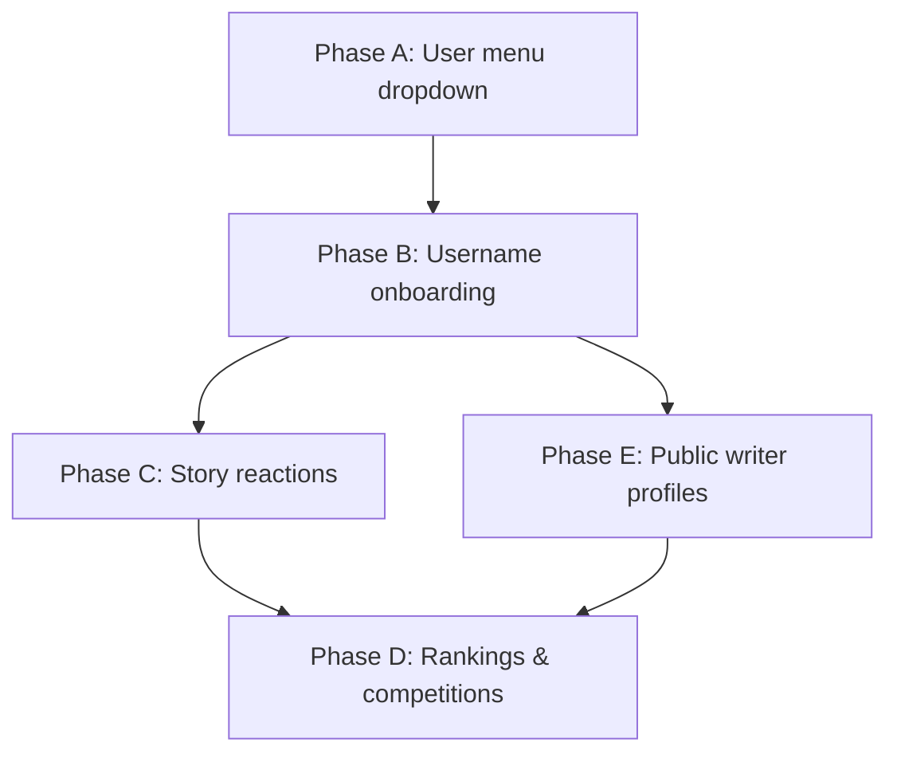

# Writer Social Features — Product & Implementation Plan

**Created:** July 6, 2026  
**Status:** ✅ Implemented — see [WRITER-SOCIAL-FEATURES-TODO.md](./WRITER-SOCIAL-FEATURES-TODO.md)

---

## Recommendation: Yes — but phased

All three ideas fit the product and reinforce each other:

| Feature | Verdict | Why |
|---------|---------|-----|
| User menu dropdown | **Do now** | Removes nav clutter; standard pattern |
| Unique `@username` + onboarding | **Do next** | Foundation for public profiles, attribution, leaderboards |
| Like/dislike + rankings | **Do after profiles** | Needs stable writer identity and story↔writer links |
| Public writer pages | **Do with usernames** | Low cost once `@username` routes exist |

**Caution on dislikes:** Public dislikes can discourage writers. Recommended compromise:
- **Likes** are public and drive rankings.
- **Dislikes** are optional phase 2, or replaced with private "hide this category" signals.
- Rankings use **net score** (`likes - dislikes`) or **likes only** for leaderboards.

---

## Phase A — Header user menu (immediate)

### Current problem
- `Profile` sits in main nav alongside Home/Stories.
- Username + Sign out sit awkwardly in the auth strip.
- Feels like two account UIs competing.

### Target UX

```
[Brand]  Home  Stories  Submit  Admin          [Avatar ▾]
                                                  ├─ My Profile
                                                  ├─ Edit Profile
                                                  └─ Sign out
```

- Remove **Profile** from `navbar-links`.
- Replace flat `user-menu` with a **dropdown** triggered by avatar + `@username`.
- **Sign out** lives inside dropdown only.
- Mobile: same items inside the slide-down menu under a "Account" section.

### Files
- `src/components/Navbar.tsx` — dropdown state, click-outside, Escape
- `src/components/UserMenu.tsx` — new (optional extract)
- `src/index.css` — `.user-menu-dropdown`, `.user-menu-trigger`

**Estimate:** 2–3 hours

---

## Phase B — Username onboarding & edit profile

### Goals
- Every user picks a **unique `@username`** (GitHub-style).
- Prompt on **first login** if username is auto-generated or missing.
- **Edit profile** page for username, display name, bio (age optional, private).

### Database migration `004_profiles_social.sql`

```sql
ALTER TABLE public.profiles
  ADD COLUMN IF NOT EXISTS display_name TEXT,
  ADD COLUMN IF NOT EXISTS bio TEXT CHECK (char_length(bio) <= 500),
  ADD COLUMN IF NOT EXISTS avatar_url TEXT,
  ADD COLUMN IF NOT EXISTS onboarding_complete BOOLEAN NOT NULL DEFAULT false,
  ADD COLUMN IF NOT EXISTS username_changed_at TIMESTAMPTZ;

-- Case-insensitive unique username
CREATE UNIQUE INDEX IF NOT EXISTS profiles_username_lower_idx
  ON public.profiles (lower(username));

-- Validate format at app layer; optional DB check:
-- username ~ '^[a-zA-Z0-9_]{3,24}$'
```

### Username rules (app + API)
- 3–24 characters: `a-z`, `A-Z`, `0-9`, `_`
- Case-insensitive uniqueness (`lower(username)`)
- Reserved: `admin`, `profile`, `stories`, `submit`, `api`, `auth`, etc.
- On signup trigger: set `username = NULL`, `onboarding_complete = false` (stop auto-filling from email — forces pick)

### Onboarding flow
1. User signs in with Google → `AuthCallback` → app loads.
2. If `!profile.onboarding_complete` → redirect to `/onboarding/username`.
3. Form: pick `@username`, optional display name.
4. Server checks uniqueness → save → `onboarding_complete = true`.
5. Protected routes (`/submit`, `/profile`) blocked until complete.

### Edit profile (`/profile/edit`)
- Change username (rate-limit: once per 30 days).
- Display name, bio (max 500 chars).
- Avatar upload (reuse story image pipeline, smaller size).
- **Do not show age publicly** — age gate covers site access; optional birth year stored private if needed later.

### Files
- `supabase/migrations/004_profiles_social.sql`
- `src/pages/OnboardingUsername.tsx`
- `src/pages/EditProfile.tsx`
- `src/lib/username.ts` — validation + reserved list
- `src/components/ProtectedRoute.tsx` — gate incomplete onboarding
- Update `handle_new_user()` trigger

**Estimate:** 1–2 days

---

## Phase C — Story reactions (likes / dislikes)

### Goals
- Only **logged-in** users can react.
- One reaction per user per story (like, dislike, or none).
- Writers **cannot** like their own stories (RLS).

### Database migration `005_story_reactions.sql`

```sql
CREATE TABLE public.story_reactions (
  id UUID PRIMARY KEY DEFAULT gen_random_uuid(),
  story_id UUID NOT NULL REFERENCES public.stories(id) ON DELETE CASCADE,
  user_id UUID NOT NULL REFERENCES auth.users(id) ON DELETE CASCADE,
  reaction TEXT NOT NULL CHECK (reaction IN ('like', 'dislike')),
  created_at TIMESTAMPTZ NOT NULL DEFAULT NOW(),
  UNIQUE (story_id, user_id)
);

CREATE INDEX idx_reactions_story ON public.story_reactions(story_id);
CREATE INDEX idx_reactions_user ON public.story_reactions(user_id);

-- Denormalized counters on stories (fast sorting)
ALTER TABLE public.stories
  ADD COLUMN IF NOT EXISTS like_count INTEGER NOT NULL DEFAULT 0,
  ADD COLUMN IF NOT EXISTS dislike_count INTEGER NOT NULL DEFAULT 0;

-- Trigger or RPC to update counts on insert/update/delete
```

### RLS policies
- `SELECT`: public (aggregate counts on stories; own reaction visible to self).
- `INSERT/UPDATE/DELETE`: `auth.uid() = user_id` AND story is approved AND `user_id != story.user_id`.

### UI
- `StoryDetail`: thumbs up / thumbs down below title or end of article.
- Show counts; highlight user's current reaction.
- Prompt sign-in if anonymous.

### Files
- `src/components/StoryReactions.tsx`
- `src/hooks/useStoryReaction.ts`
- `StoryDetail.tsx`, `StoryCard.tsx` (optional like count badge)

**Estimate:** 2 days

---

## Phase D — Rankings & competitions

### Ranking dimensions

| Badge | Logic | Refresh |
|-------|-------|---------|
| **Story of the Week** | Highest `like_count` among stories approved in last 7 days | Daily cron or query |
| **Story of the Month** | Same, 30-day window | Daily |
| **Editor's Choice** | `is_editors_choice BOOLEAN` on stories (admin toggle) + auto-fill top 3 by net likes if empty | Manual + weekly auto |
| **Trending** | `like_count / days_since_publish` (velocity) | Real-time query |
| **Top Writers** | `SUM(like_count)` on approved stories per `user_id` | Materialized view or query |

### Database migration `006_rankings.sql`

```sql
ALTER TABLE public.stories
  ADD COLUMN IF NOT EXISTS is_editors_choice BOOLEAN NOT NULL DEFAULT false,
  ADD COLUMN IF NOT EXISTS editors_choice_at TIMESTAMPTZ;

-- Optional materialized view for writer leaderboard
CREATE MATERIALIZED VIEW public.writer_leaderboard AS
SELECT
  p.id AS user_id,
  p.username,
  p.display_name,
  COUNT(s.id) AS story_count,
  COALESCE(SUM(s.like_count), 0) AS total_likes
FROM public.profiles p
LEFT JOIN public.stories s ON s.user_id = p.id AND s.status = 'approved'
GROUP BY p.id, p.username, p.display_name;

CREATE UNIQUE INDEX ON public.writer_leaderboard (user_id);
```

### UI surfaces
- **Home:** "Editor's Choice" row + "Story of the Week" hero.
- **Stories:** sort option "Top rated" / "Trending".
- **Leaderboard page** `/writers` — top writers this month.
- **Admin:** toggle Editor's Choice on story cards.

### Anti-gaming
- One account = one vote (DB unique constraint).
- No self-likes (RLS).
- Ignore reactions from accounts &lt; 24h old (optional).
- Rate-limit reaction toggles (client debounce + optional edge function).

**Estimate:** 2–3 days

---

## Phase E — Public writer profiles

### Route
- `/writer/:username` — public, read-only (like X/Twitter profile).

### Shows
- Avatar, `@username`, display name, bio.
- Stats: stories published, total likes, member since.
- Grid of **approved** stories only.
- No email, no age, no private drafts.

### Story attribution
- `StoryDetail` header: "By @username" linking to `/writer/:username`.

### Files
- `src/pages/WriterProfile.tsx`
- `App.tsx` route
- `StoryDetail.tsx` author link

**Estimate:** 1 day (after Phase B usernames)

---

## Implementation order (DAG)



---

## Open decisions for product owner

1. **Dislikes public or likes-only?** (Recommend likes-only for v1)
2. **Username change cooldown?** (Recommend 30 days)
3. **Reader accounts vs writer accounts?** Currently all signed-in users are writers. Add `role: reader` later?
4. **Editor's Choice:** admin-only manual, or auto + admin override?
5. **Leaderboard period:** all-time, monthly, or both?

---

## Effort summary

| Phase | Scope | Days |
|-------|-------|------|
| A | User menu dropdown | 0.5 |
| B | Username + edit profile | 1–2 |
| C | Likes/dislikes | 2 |
| D | Rankings + competitions | 2–3 |
| E | Public writer profiles | 1 |
| **Total** | | **~7–9 days** |

Start with **A + B** — they unblock everything else and fix the header UX immediately.